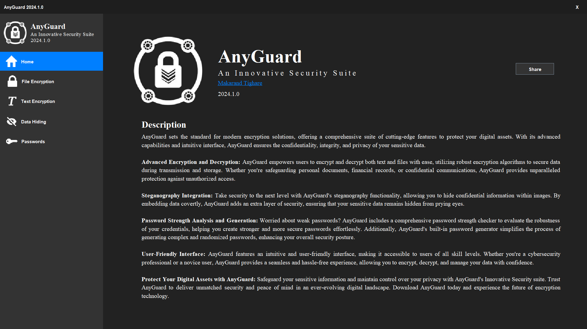

# AnyGuard Encryption Suite

A multi-purpose encryption suite for **file and text encryption** using **AES encryption** and **steganography**, designed for secure data management with a user-friendly interface.



## Features
- **AES Encryption**: Provides file and text encryption with industry-standard AES encryption.
- **Steganography**: Hides encrypted text inside images using the Least Significant Bit (LSB) technique.
- **Password Management**: Offers strong password generation and strength checking.
- **User Interface**: Built with **Java Swing** for a simple and accessible GUI.

## Technologies Used
- **Java**: Main programming language.
- **AES Encryption**: For secure encryption of files and text.
- **Steganography**: Hides encrypted messages within images.
- **Java Swing**: For creating the graphical user interface.

## Project Structure
All code is contained within a single file: `Main.java`. This file contains approximately 3000 lines of code implementing all encryption, steganography, and UI functionality.

## Installation and Setup
1. **Clone the repository**:
    ```bash
    git clone https://github.com/yourusername/AnyGuard.git
    ```
2. **Navigate to the project directory**:
    ```bash
    cd AnyGuard
    ```
3. **Compile the `Main.java` file**:
    Ensure you have **Java (version 8 or above)** installed, and compile the file using:
    ```bash
    javac Main.java
    ```
4. **Run the application**:
    ```bash
    java Main
    ```

## How to Use
1. **Encrypting Files and Text**:
   - Open the application and select the file or text to encrypt.
   - Choose AES encryption for secure encryption.
   
2. **Steganography**:
   - Upload an image to hide encrypted text.
   - Retrieve hidden messages from the image using the decryption feature.

3. **Password Management**:
   - Generate strong passwords or check the strength of a password before using it for encryption.

## Future Enhancements
- **Cloud Storage Integration**: Enable encrypted file storage on cloud platforms.
- **Support for Multiple Encryption Algorithms**: Add support for RSA encryption.
- **Batch Processing**: Handle multiple files simultaneously for encryption/decryption.

## License
This project is licensed under the MIT License. See the [LICENSE](LICENSE) file for more details.
